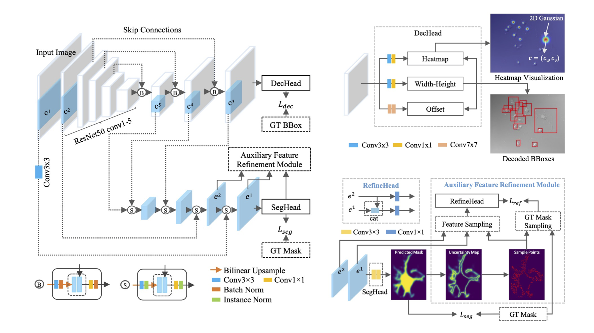

# ObjGuided-Instance-Segmentation
Object-Guided Instance Segmentation With Auxiliary Feature Refinement for Biological Images

Please cite the article in your publications if it helps your research:

	@article{yi2021tmi,
	  title={Object-Guided Instance Segmentation With Auxiliary Feature Refinement for Biological Images},
	  author={Yi, Jingru and Wu, Pengxiang and and Tang, Hui and Liu, Bo and Huang, Qiaoying and Qu, Hui and Han, Lianyi and Fan, wei and Hoeppner, Daniel J and Metaxas, Dimitris N},
	  journal={IEEE Transactions on Medical Imaging}
	}

# Introduction
Instance segmentation is of great importance for many biological applications, such as study of neural cell interactions, plant phenotyping, and quantitatively measuring how cells react to drug treatment. In this paper, we propose a novel box-based instance segmentation method. Box-based instance segmentation methods capture objects via bounding boxes and then perform individual segmentation within each bounding box region. However, existing methods can hardly differentiate the target from its neighboring objects within the same bounding box region due to their similar textures and low-contrast boundaries. To deal with this problem, in this paper, we propose an object-guided instance segmentation method. Our method first detects the center points of the objects, from which the bounding box parameters are then predicted. To perform segmentation, an object-guided coarse-to-fine segmentation branch is built along with the detection branch. The segmentation branch reuses the object features as guidance to separate target object from the neighboring ones within the same bounding box region.  To further improve the segmentation quality, we design an auxiliary feature refinement module that densely samples and refines point-wise features in the boundary regions. Experimental results on three biological image datasets demonstrate the advantages of our method.

<p align="center">
	
</p>

# Dependencies
CUDA Version: 11.2, Python 3.6.10, PyTorch 1.6.0, OpenCV-Python 4.3.0.36 

# How to start
## Train the model
```ruby
python main.py --phase train --num_epoch 100 --data_dir YourDataPath --dataset YourDatasetClass --ngpus 0 --batch_size 8 --num_workers 4 
```

## Test the model
```ruby
python main.py --phase test --data_dir YourDataPath --dataset YourDatasetClass
```


## Evaluate the model
```ruby
python main.py --phase test --data_dir YourDataPath --dataset YourDatasetClass --eval_type seg --seg_thresh 0.5
```
